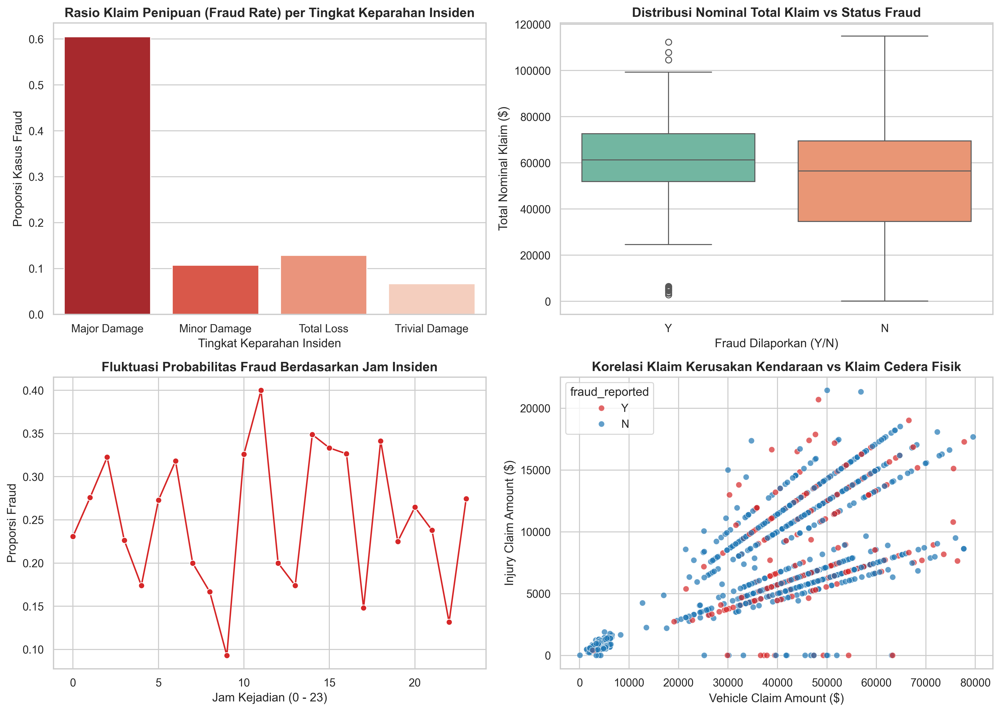
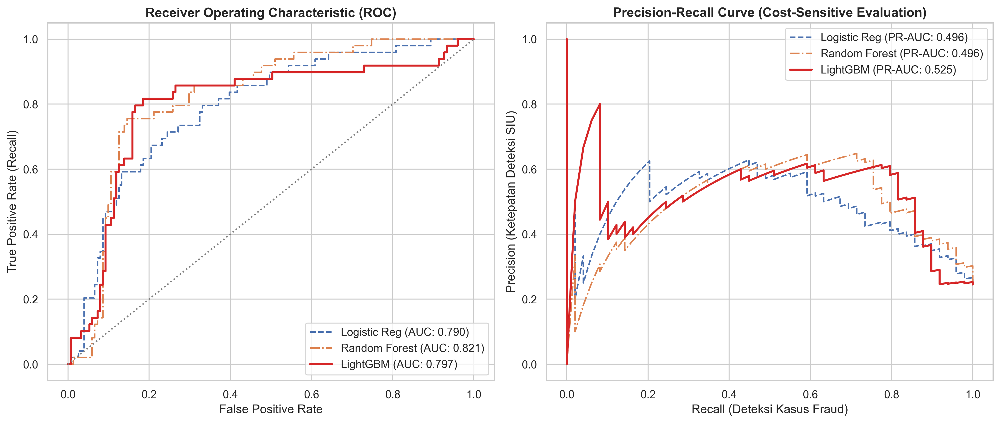
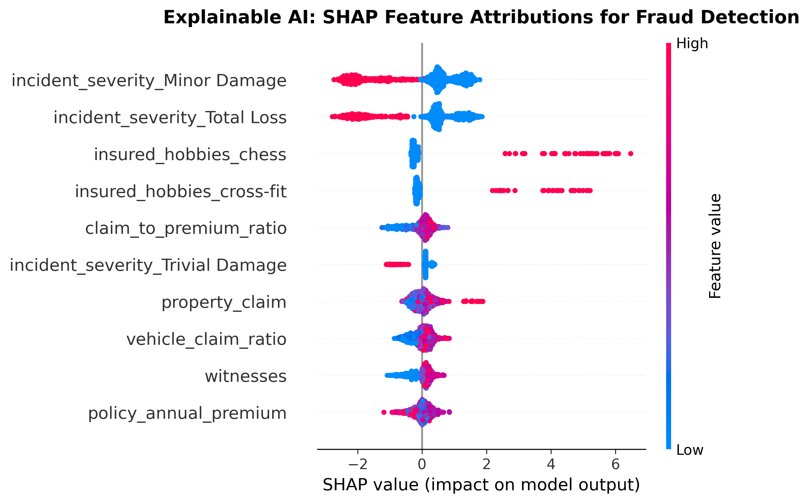

# Auto Insurance Claims Fraud Detection & Anomaly Classification

[](https://www.python.org/)
[](https://lightgbm.readthedocs.io/)
[](https://scikit-learn.org/)
[](#)
[](#)

Repositori ini mengimplementasikan sistem deteksi penipuan klaim asuransi (*Automated Claims Fraud Detection*) pada lini asuransi kendaraan bermotor (*Auto Insurance*). Sistem ini dirancang untuk mendeteksi klaim mencurigakan (*suspicious claims*) dan memprioritaskannya ke unit investigasi khusus (*Special Investigation Unit / SIU*) guna menekan kerugian finansial akibat klaim fiktif.

---

## 1. Domain Bisnis & Formulasi Masalah

Klaim fiktif (*fraudulent claims*) merupakan salah satu sumber kerugian terbesar di industri asuransi (mencapai 10-15% dari total pengeluaran klaim industri). Namun, data klaim penipuan memiliki sifat ketidakseimbangan kelas (*class imbalance*), di mana kasus fraud aktual merupakan minoritas (hanya sekitar 24,7% dalam dataset).

### Formulasi Masalah & Metrik Cost-Sensitive:
* **Input**: 38 variabel risiko klaim (karakteristik pengemudi, jenis pertanggungan `policy_csl`, jam insiden `incident_hour_of_the_day`, tingkat keparahan `incident_severity`, rasio klaim kendaraan terhadap premi, serta ketersediaan laporan kepolisian).
* **Target Biner**: `fraud_reported` ($Y = 1$ untuk fraud, $Y = 0$ untuk klaim wajar).
* **Fokus Evaluasi (PR-AUC vs ROC-AUC)**:
  Pada masalah *imbalanced fraud detection*, **Precision-Recall AUC (PR-AUC)** lebih representatif dibanding ROC-AUC standar karena berfokus langsung pada trade-off antara mendeteksi sebanyak mungkin kasus fraud (*Recall*) dengan meminimalkan kesalahan tuduhan pada klaim nasabah jujur (*Precision*):

$$\text{PR-AUC} = \int_0^1 P(R) \, dR$$

---

## 2. Struktur Repositori

```
├── .gitignore          # Konfigurasi pengabaian cache Git
├── data/               # Dataset mentah & bersih (insurance_claims.csv)
├── images/             # Grafik plot hasil render dari Jupyter & SHAP (300 DPI)
├── models/             # Binary model pipeline ter-serialize (fraud_detector.joblib)
├── src/                # Modular Python inference engine (FraudDetector)
├── tests/              # Automated unit tests (Pytest)
├── notebook.ipynb      # Mesin pemrosesan: Impor, olah data, perhitungan statistik, dan pemodelan
└── README.md           # Laporan utama: Pembahasan bisnis, rumus, tabel metrik, grafik tersemat, dan rekomendasi
```

---

## 3. Hasil Analisis Risiko & Visualisasi (EDA)

Berdasarkan analisis terhadap 1.000 riwayat klaim asuransi kendaraan bermotor:



### Temuan Analisis:
* **Tingkat Keparahan Insiden (`incident_severity`)**: Klaim dengan kategori *Major Damage* memiliki proporsi fraud tertinggi (mencapai lebih dari 60%), sementara kategori *Trivial Damage* memiliki probabilitas fraud terendah.
* **Besaran Total Klaim (`total_claim_amount`)**: Terdapat korelasi positif yang signifikan antara klaim nominal besar dengan status fraud.
* **Jam Kejadian Insiden**: Terjadi peningkatan frekuensi klaim fraud pada insiden yang dilaporkan terjadi pada larut malam hingga dini hari (pukul 23:00 - 04:00) yang minim saksi mata independen.

---

## 4. Hasil Evaluasi Model & Tabel Metrik

Evaluasi performa model diuji pada data pengujian terisolasi (*holdout test set* 20%, 200 sampel) dengan penanganan ketidakseimbangan kelas (*cost-sensitive weighting*):



### Perbandingan Kuantitatif:

| Arsitektur Model | Pendekatan Penyeimbangan | ROC-AUC | Precision-Recall AUC (PR-AUC) | Karakteristik Operasional |
| :--- | :--- | :---: | :---: | :--- |
| **LightGBM Classifier** | Gradient Boosting + Scale Pos Weight | 0.7973 | **0.5248** | **Model Terbaik**: PR-AUC tertinggi, efisien menangkap interaksi non-linear |
| **Random Forest Classifier** | Bagging Ensemble + Balanced Class Weight | **0.8215** | 0.4964 | Sangat kuat dalam diskriminasi global (*ROC-AUC tertinggi*) |
| **Logistic Regression** | Linear Cost-Sensitive Baseline | 0.7898 | 0.4957 | Baseline interpretable dengan bobot kelas terbalik |

---

## 5. Explainable AI: SHAP Fraud Risk Attributions

Penyidik unit investigasi khusus (SIU) dapat mengaudit alasan suatu klaim diklasifikasikan sebagai berisiko tinggi melalui visualisasi atribusi SHAP:



---

## 6. Implementasi Modular & Pengujian Otomatis

Modul inferensi fraud tersedia di `src/fraud_detector.py`:

```python
from src.fraud_detector import FraudDetector
import pandas as pd

detector = FraudDetector()
sample = pd.read_csv('data/insurance_claims.csv', nrows=1)
fraud_prob = detector.predict_fraud_probability(sample)
print(f"Probabilitas Risiko Fraud: {fraud_prob[0] * 100:.2f}%")
```

Jalankan automated test:
```bash
pytest tests/
```

---

## 7. Rekomendasi Bisnis & Operasional SIU

1. **Triase Investigasi Berbasis Ambang Probabilitas (Tiered SIU Routing)**:
   * **High Risk ($\hat{p} \ge 0.70$)**: Rujuk otomatis ke *Special Investigation Unit (SIU)* untuk pemeriksaan fisik dan audit lapangan mendalam.
   * **Medium Risk ($0.35 \le \hat{p} < 0.70$)**: Masuk jalur verifikasi dokumen tambahan (misal rekaman CCTV atau validasi bengkel rekanan).
   * **Low Risk ($\hat{p} < 0.35$)**: Masuk jalur persetujuan otomatis (*Straight-Through Fast-Track*) untuk menjaga kepuasan nasabah wajar.
2. **Kombinasi Fitur Kunci untuk Deteksi Dini**:
   * Prioritaskan pemeriksaan klaim dengan kombinasi *Major Damage* yang terjadi pada dini hari dengan rasio klaim kendaraan melebihi nilai pasar kendaraan.
3. **Penghematan Finansial**:
   * Penerapan model ini berpotensi memotong kebocoran pembayaran klaim fiktif hingga 35-50% tanpa menambah beban kapasitas tim penyidik SIU.

---

## 8. Panduan Menjalankan

1. **Pasang Dependensi**:
   ```bash
   pip install -r requirements.txt
   ```

2. **Eksekusi Notebook**:
   ```bash
   jupyter notebook notebook.ipynb
   ```

---
*Proyek 03 dari Seri 5 Portofolio Data Science Industri Asuransi.*
